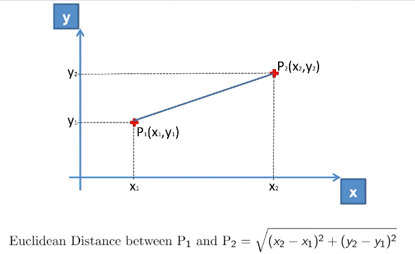
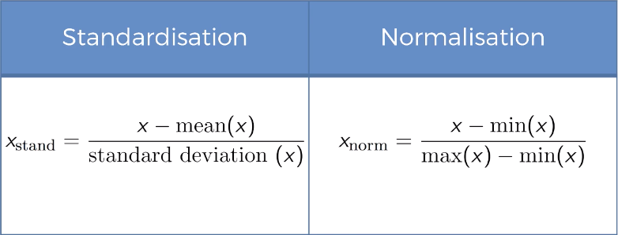
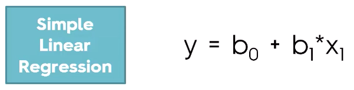
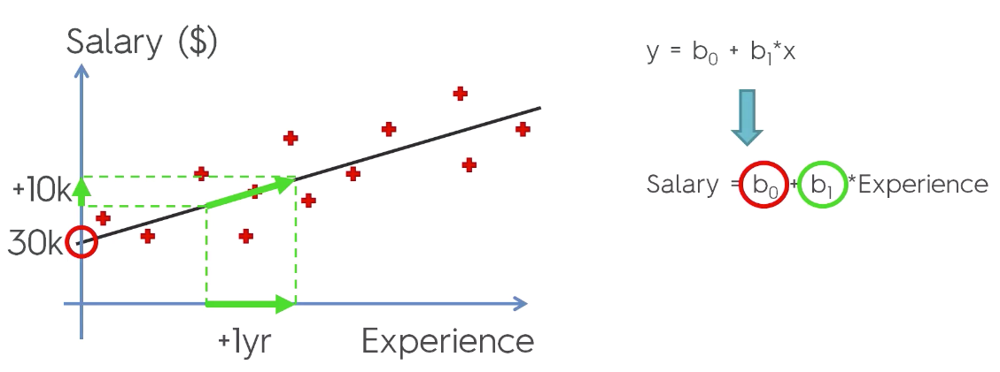
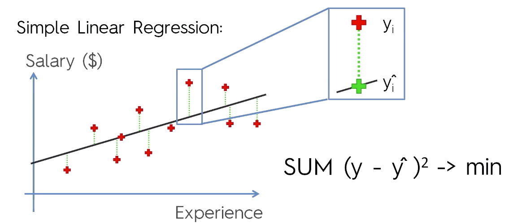
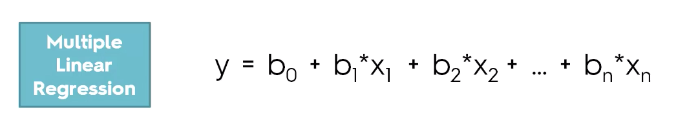
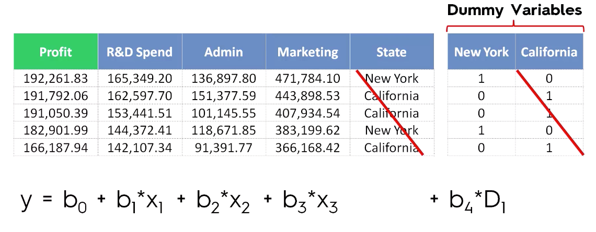

# Machine Learning

# Data Preprocessing

## Three essential libraries
1. numpy `[import numpy as np]` - Includes mathematical codes
2. matplotlib.pytplot `[import matplotlib.pyplot as plt]` - Includes plotting of Graph
3. pandas `[import pandas as pd]` - Helps in import and manage dataset

### How to handle the missing data?
1. Delete the row (Not recommended if the row holds crucial data)
2. Find the mean of the column and fill the data (Recommended)

To find the mean:
Library **SKLearn** is used to execute science equations
For example we use ScienceKit to find the mean

**Imputer definition:**
```
Imputer(missing_values="NaN", strategy="mean", axis=0, verbose=0, copy=True)
```

To find the mean use the following code:
```
imputer = Imputer(missing_values = 'NaN', strategy = 'mean', axis = 0)

Available strategy's are:
* mean
* median
* most_frequent
```

To categorize the input data, we use **SKLearn LabelEncoder**
```
from sklearn.preprocessing import LabelEncoder
labelencoder_X = LabelEncoder()
X[:, 0] = labelencoder_X.fit_transform(X[:, 0])
```

The problem with **LabelEncoder** is that _Machine Learning_ models are based on equations. Equations require numbers than strings.


Consider the following example:

Country | LabelEncoder Value
:--------:| :------------------:
France  | 0
Spain   | 1
Germany | 2

Here since `1 > 0` means Spain is greater than France, which is not the case because these countries are three different categories and not dependant variable.

To prevent *MachineLearning* model to prevent thinking like this, **Dummy Encoding** is used.

**Dummy Encoding** <br>
Here instead of having one column we will be having 3 columns like below:<br>

|Country|
|:-------:|
|France|
|Spain|
|Germany|

<br>

|France|Spain|Germany|
|:-------:|:-------:|:-------:|
|1|0|0|
|0|1|0|
|0|0|1|

We use **SKLearn OneHotEncoder** to achieve Dummy Encoding
```
from sklearn.preprocessing import LabelEncoder, OneHotEncoder
labelencoder_X = LabelEncoder()
X[:, 0] = labelencoder_X.fit_transform(X[:, 0])
onehotencoder = OneHotEncoder(categorical_features = [0])
X = onehotencoder.fit_transform(X).toarray()
```

**Splitting the data set into Training set and Test set**<br />
Thre reason to split the data into Training set and Test set is to avoid memoisation by model. For example consider that if we train our model with all the data we have, then model will try to remember the result for all inputs just like **by-heart**. To avoid this, it is always recommended to split the data.

```
from sklearn.model_selection import train_test_split
X_train, X_test, y_train, y_test = train_test_split(X, y, test_size = 0.2, random_state = 0)
```

**Feature Scaling**
When 2 variables are not in the same scale which will cause issues in Machine Learning model because most of the Machine Learning models are based on the `Euclidean Distance`



To scale the data, we use mostly the following



<br>
To scale the value, we use `SKLear Preprocessing's Standard Scaler`

```
from sklearn.preprocessing import StandardScaler
sc_X = StandardScaler()
X_train = sc_X.fit_transform(X_train)
X_test = sc_X.transform(X_test)
```

<br>

### **Do we need to scale the DUMMY variables?** <br>
It depends on the context. It depends on how we want to keep interpreted in out model.<br>

Advantage | Disadvantage
:---------- | :----------
All data will be in the same scale, which is good for prediction | Will lose the interpretation of knowing which observation belongs to which

**But it wont break the model**

<br>

### **Do we need to scale dependant variable vector y_train and y_test?** <br>
NO. Since the `y_train` and `y_test` is a boolean classifier, the data avaiable is only `0 and 1`

### Data Preprocessing Template
```
# Importing the libraries
import numpy as np
import matplotlib.pyplot as plt
import pandas as pd

# Importing the dataset
dataset = pd.read_csv('Data.csv')

# Create matrix of features. Taking all cols -1 values
X = dataset.iloc[:, :-1].values
#dfx = pd.DataFrame(X)
y = dataset.iloc[:, 3].values
#dfy = pd.DataFrame(y)

#labelencoder_Y = LabelEncoder()
#y = labelencoder_Y.fit_transform(y)

# Splitting the dataset into the Training set and Test set
from sklearn.model_selection import train_test_split
X_train, X_test, y_train, y_test = train_test_split(X, y, test_size = 0.2, random_state = 0)

# Feature scaling
"""from sklearn.preprocessing import StandardScaler
sc_X = StandardScaler()
X_train = sc_X.fit_transform(X_train)
X_test = sc_X.transform(X_test)"""
```

## QUIZ
**Question 1:**<br>
In Python, which of the following library can best help manage datasets ?<br>
1. numpy
2. pandas
3. matplotlib

<details><summary>Check answer</summary>

```
pandas
```
</details>
<br>

**Question 2:**<br>
Which of the following is not a recommended strategy to take care of missing data ?
1. Replace the missing data by the median of the feature column
2. Delete the observation that contains the missing data
3. Replace the missing data by the mean of the feature column
4. Replace the missing data by the most frequent value of the feature column

<details><summary>Check answer</summary>

```
Delete the observation that contains the missing data
```
</details>
<br>

**Question 3:**<br>
Do we need to apply OneHotEncoder to encode an independent variable that gives the size S, M or L of a t-shirt ?
1. Yes
2. No

<details><summary>Check answer</summary>

```
No
```
</details>
<br>

**Question 4:**<br>
What is the worst choice of split ratio Training set : Test set ?
1. 80:20
2. 75:25
3. 50:50

<details><summary>Check answer</summary>

```
50:50
```
</details>
<br>
<br>

# Regression
Regression models (both linear and non-linear) are used for predicting a real value, like salary for example. If your independent variable is time, then you are forecasting future values, otherwise your model is predicting present but unknown values. Regression technique vary from Linear Regression to SVR and Random Forests Regression.

In this part, you will understand and learn how to implement the following Machine Learning Regression models:
```
1. Simple Linear Regression
2. Multiple Linear Regression
3. Polynomial Regression
4. Support Vector for Regression (SVR)
5. Decision Tree Classification
6. Random Forest Classification
```

## Simple Linear Regression
Formula:


```
y = Dependant variable(DV)
x = Independant variable(IV)
b1 = Coefficient
b0 = Constant
```



<br>

**Ordinary Least Squares**


<br>
Let's write python script:

**Data Preprocessing**
```
# Importing the libraries
import numpy as np
import matplotlib.pyplot as plt
import pandas as pd

# Importing the dataset
dataset = pd.read_csv('Salary_Data.csv')

# Create matrix of features. Taking all cols -1 values
X = dataset.iloc[:, :-1].values
y = dataset.iloc[:, 1].values

# Splitting the dataset into the Training set and Test set
from sklearn.model_selection import train_test_split
X_train, X_test, y_train, y_test = train_test_split(X, y, test_size = 1/3, random_state = 0)

# Feature scaling
# No need of scaling input since most of the Linear Regression Libraries does
# If you have any special scaling factor, then perform scaling
"""from sklearn.preprocessing import StandardScaler
sc_X = StandardScaler()
X_train = sc_X.fit_transform(X_train)
X_test = sc_X.transform(X_test)"""
```
<br>


**Linear Regression** library is provided in **Sci Kit** 
```
from sklearn.linear_model import LinearRegression
```

Steps we will follow to create simple Linear Regression is:<br>
1. Import `Linear Regression` class from `SK`
2. Create a `regressor` object from `Linear Regression` class
3. Fit the `regressor` to the training set

To fit the regressor to the training set, we use `fit()` method from `LinearRegression class`

```
# Fitting Simple Linear Regression to the Training Set
from sklearn.linear_model import LinearRegression
regressor = LinearRegression()
regressor.fit(X_train, y_train)
```

Now our Machine has learned using Linear Regression<br>
Lets test how well it can predict the values for *test data*

To start prediction, we follow:<br>
1. Create a `vector` of predicted values
2. Call `predict` method from `Linear Regression` class

```
# Predicting the Test set result
y_pred = regressor.predict(X_test)
```

**Visualising the Training set results**
To plot in python, we use `matplotlib`<br>
Let first Plot the real observation point.
```
# Visualising the Training set results
# 1. Plotting using scatter graph
plt.scatter(X_train, y_train, color = 'red') 
# 2. Here plot X_train data vs Linear Regression Predicted X_train data just for 
#    understanding Accuracy of our prediction model
plt.plot(X_train, regressor.predict(X_train), color = 'blue')
# Setting the title for Graph
plt.title('Salary vs Experience(Training set)')
# Setting label for X and Y axis
plt.xlabel('Experience in years')
plt.ylabel('Salary')
# Finally show the graph
plt.show()
```
<br>

**Visualising the Test set results**

```
# Visualising the Test set results
# 1. Plotting using scatter graph
plt.scatter(X_test, y_test, color = 'red') 
# 2. Here plot X_train data vs Linear Regression Predicted X_train data just for 
#    understanding Accuracy of our prediction model
plt.plot(X_train, regressor.predict(X_train), color = 'blue')
# Setting the title for Graph
plt.title('Salary vs Experience(Test set)')
# Setting label for X and Y axis
plt.xlabel('Experience in years')
plt.ylabel('Salary')
# Finally show the graph
plt.show()
```

## QUIZ
**Question 1:**<br>
We should use Simple Linear Regression to predict the winner of a football game?<br>
1. Yes
2. No

<details><summary>Check answer</summary>

```
No
```
</details>
<br>

**Question 2:**<br>
What is the class used in Python to create a simple linear regressor ?<br>
1. SimpleLinear
2. LinearRegression
3. SimpleLinearRegression

<details><summary>Check answer</summary>

```
LinearRegression
```
</details>
<br>

**Question 3:**<br>
Which of the following formulas is not a simple linear regression model ?<br>
1. Salary = a * Experience
2. Salary = a * Experience + b
3. Salary = a * Experience + b * Age

<details><summary>Check answer</summary>

```
Salary = a * Experience + b * Age
```
</details>
<br>

## Multiple Linear Regression
Formula:


```
y = Dependant variable(DV)
x1, x2 .. xn = Independant variable(IV)
b1 = Coefficient
b0 = Constant
```

Before starting **Multiple Linear Regression** there is some Caveat(Limitations) in **Linear Regression**<br>
Linear Regression's have assumptions, they are:<br>
1. **Linearity** (*Linearity is the behavior of a circuit, particularly an amplifier , in which the output signal strength varies in direct proportion to the input signal strength*)
2. **Homoscedasticity** (*In statistics, a sequence or a vector of random variables is homoscedastic /ˌhoʊmoʊskəˈdæstɪk/ if all random variables in the sequence or vector have the same finite variance.*)
3. **Multivariate normality** (*It is the normal is parameterized by its mean and variance, but unlike the univariate normal, the former is a mean vector and the latter is a covariance matrix.*)
4. **Independence of errors** (*Checking the Independence of Errors Assumption. The "I" in the LINE mnemonic stands for Independence of Errors. This means that the distribution of errors is random and not influenced by or correlated to the errors in prior observations. The opposite is independence is called autocorrelation.*)
5. **Lack of multicollinearity** (*In statistics, multicollinearity (also collinearity) is a phenomenon in which one predictor variable in a multiple regression model can be linearly predicted from the others with a substantial degree of accuracy.*)

Before building **Linear Regression** model, make sure these assumptions are true

In the given data set `50_Startups.csv` we need to perform `Data Preprocessing` the same way we did earlier with `Linear Regression`. In this example, we need to make ud `Dummy variable` since we column with state names. We need to replace state names into separate columns with `0 or 1 value`



<br>

**Dummy Variable Trap**

Whenever building a model, always `OMIT 1 Dummy variable` in the set.<br>
For example if you have 9, then only include 8 Dummy variable.


---------------

**P-Value**<br>
Before continuing to `Backward eliminaiton`, lets understand `What is the P-Value?`

In statistics, we always seem to come across this p-value thing. If you have been studying for a while, you are used to the idea that a small p-value makes you reject the null hypothesis. But what if I asked you to explain exactly what that number really represented!?

Understanding the p-value will really help you deepen your understanding of hypothesis testing in general. Before I talk about what the p-value is, let’s talk about what it isn’t.

1. **The p-value is NOT the probability the claim is true.** Of course, this would be an amazing thing to know! Think of it “there is 10% chance that this medicine works”. Unfortunately, this just isnt the case. Actually determining this probability would be really tough if not impossible!
The p-value is NOT the probability the null hypothesis is true. Another one that seems so logical it has to be right! This one is much closer to the reality, but again it is way too strong of a statement.
2. **The p-value is actually the probability of getting a sample like ours, or more extreme than ours IF the null hypothesis is true.** So, we assume the null hypothesis is true and then determine how “strange” our sample really is. If it is not that strange (a large p-value) then we don’t change our mind about the null hypothesis. As the p-value gets smaller, we start wondering if the null really is true and well maybe we should change our minds (and reject the null hypothesis).

A little more detail: A small p-value indicates that by pure luck alone, it would be unlikely to get a sample like the one we have if the null hypothesis is true. If this is small enough we start thinking that maybe we aren’t super lucky and instead our assumption about the null being true is wrong. Thats why we reject with a small p-value.

A large p-value indicates that it would be pretty normal to get a sample like ours if the null hypothesis is true. So you can see, there is no reason here to change our minds like we did with a small p-value.

For more detailed information, watch it on [YouTube - Understanding the P-Variable](https://www.youtube.com/watch?v=eyknGvncKLw)

-----------

### Buliding a Model

5 methods of builiding a model
1. All-in
2. Backward Elimination
3. Forward Selection
4. Bidirectional Elimination
5. Score Comparision

**Backward Elimination, Forward Selection & Bidirectional Elimination** are known as `Stepswise Regression`

<br>

**All-in**<br>
Throwing all your variables to build a model. Following are the cases we use **All-in**
1. Prior knowledge; OR
2. You have to; OR
3. Prerparing for Backward Elimination

**Backward Elimination**<br>
1. Select a significance level to stay in the model(eg, SL = 0.05)
2. Fit the full model in all possible predictors
3. Consider the predictor with highest `P-Value`. If **P > SL** go to **STEP 4** else go to **FIN**
4. Remove the Preditor
5. Fit model without this variable. Go to **STEP 3** and repeat the process

**FIN(FINISH):** Model is Ready
